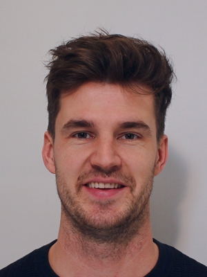

```{r, include=FALSE}
knitr::opts_chunk$set(
  results='asis', 
  echo = FALSE
)
library(tidyverse)
library(glue)

# Set this to true to have links turned into footnotes at the end of the document
PDF_EXPORT <- T

# Holds all the links that were inserted for placement at the end
links <- c()

source('parsing_functions.R')


# First let's get the data, filtering to only the items tagged as
# Resume items
position_data <- read_delim("positions.csv", 
    ";", escape_double = FALSE, trim_ws = TRUE, skip_empty_rows = T) %>% 
  filter(in_resume) %>% 
  mutate(
    # Build some custom sections by collapsing others
    section = case_when(
      section %in% c('research_positions', 'industry_positions') ~ 'positions', 
      section %in% c('data_science_writings', 'by_me_press') ~ 'writings',
      section %in% c('Oter_activity') ~ 'activity',

      TRUE ~ section
    )
  ) 

```


Aside
================================================================================


{width=100%}

Contact {#contact}
--------------------------------------------------------------------------------


- <i class="fas fa-home"></i> 3052 XG, 124, Rotterdam 
- <i class="fa fa-envelope"></i> marcobunt@gmail.com
- <i class="fab fa-linkedin"></i> [linkedin.com](https://www.linkedin.com/in/marco-bunt-47a2893a/?originalSubdomain=nl)
- <i class="fa fa-github"></i> github.com/MeneerBunt
- <i class="fa fa-phone"></i> (+31) 623854643
- <i class="fas fa-user"></i> 06-10-1987

Skills {#skills}
--------------------------------------------------------------------------------

```{r}
skills <- tribble(
  ~skill,               ~level,
  "Analytics (Python, R, SQL) ", 4.75,
  "Communication (EN, NL)",  4.6,
  "Maintenance enginering", 4,
  "Research", 4.2,
  "Sociology", 4.1,
  "Sustainability", 4.55
  
  
)
build_skill_bars(skills)
```

OFF-TIME {#open-source}
--------------------------------------------------------------------------------

- Guitair
- Singing (churchband)
- Sport (cycling, running)
- House renovations
- Reading

References {#more-info}
--------------------------------------------------------------------------------

Yakup Koc (supervisor)<br>
- Manager Grid-analytics <br>
<i class="fa fa-envelope"></i> Yakup.Koc@stedin.net <br>
<i class="fa fa-phone"></i> (+31) 618340069

Michiel Tramper (friend)<br>
- Owner creativesolvers <br>
<i class="fa fa-envelope"></i> michiel@creativesolvers.com <br>
<i class="fa fa-phone"></i> (+31) 618340069

Main
================================================================================

Marco Bunt {#title}
--------------------------------------------------------------------------------

```{r}
intro_text <- "
  A driven researcher with strong communication skills. Specialized in the energy field and works well in multidisciplinary teams and always challenges himself to do better. Likes to work on system integration, sustainability, and many other things.

At the moment working as a data-scientist on complex models. Not as a lonely researcher in an ivory tower, but with feet firmly embedded in the business. Has a firm conviction that people should not be alone. Not in their private life, not in their professional life.

"


cat(sanitize_links(intro_text))
```


Selected Positions {data-icon=suitcase}
--------------------------------------------------------------------------------

```{r}
position_data %>% print_section('positions')
```

Education {data-icon=graduation-cap data-concise=true}
--------------------------------------------------------------------------------

```{r}
position_data %>% print_section('education')
```

Activity {data-icon=newspaper}
--------------------------------------------------------------------------------

```{r}
position_data %>% print_section('activity')
```


